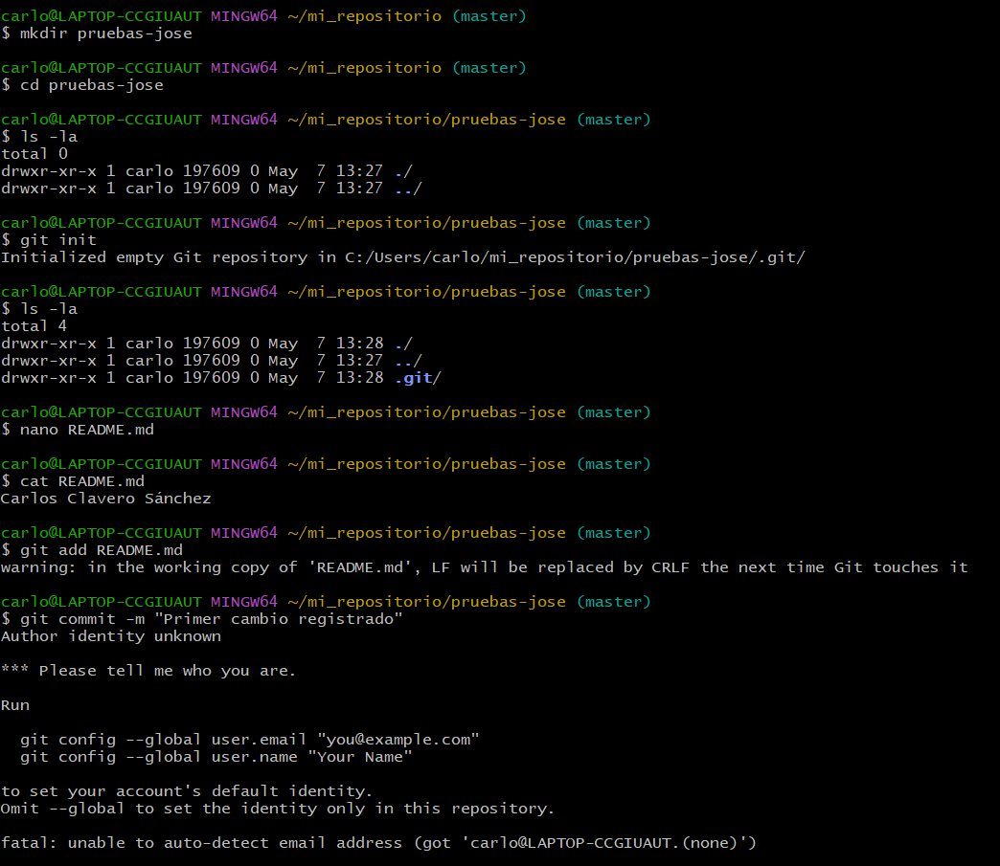
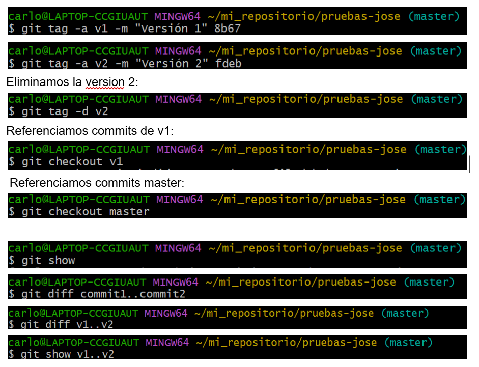
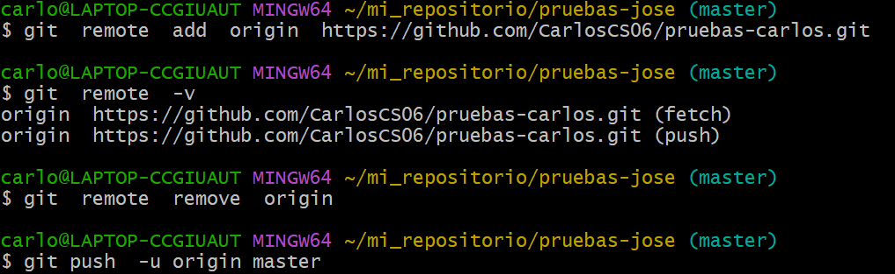
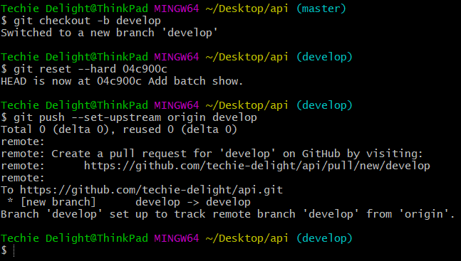
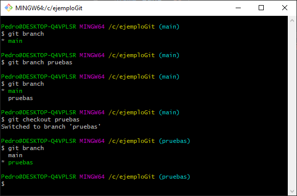

# Apuntes Tema 4

---

### 🔵 **Índice**

1. [Uso de comandos git](###uso-de-comandos-git)  
2. [Generación de documentación para Java, con Javadoc](###generación-de-documentación-para-java-con-javadoc)  
3. [Optimización del código](###optimización-del-código)

---

## 📁 1. Uso de comandos Git

Esta sección cubre los fundamentos del uso de Git para gestionar proyectos. Se incluyen explicaciones básicas y prácticas sobre cómo realizar tareas comunes.

---

### 🔹 Secciones de un proyecto Git

Cuando inicializas un proyecto con `git init`, se crea una carpeta oculta llamada `.git` que contiene toda la información del repositorio: historial de commits, configuración, ramas, etc. Las secciones clave incluyen:

- `HEAD`: apunta a la rama activa.
- `config`: configuración del repositorio.
- `objects/`: almacena los objetos (commits, blobs, etc.).
- `refs/`: referencias a ramas y etiquetas.

---

### 🔹 Inicializar y guardar cambios en un repositorio local

1. Crear un repositorio:
   ```bash
   git init
2. Añadir archivos al "staging":
   ```bash
   git add archivo.txt 
3. Hacer un commit:
   ```bash
   git commit -m "Primer commit"

Aquí se puede ver un ejemplo de estos comandos probados a traves de git:



### 🔹 Revisar los distintos commits realizados

Para ver el historial de commits:

   ```bash
   git log
   ```

También puedes usar:

   ```bash
   git log --oneline --graph --all
   ```
Esto muestra los commits de forma visual y resumida.

### 🔹 Etiquetando commits y viendo diferencias

Puedes etiquetar un commit (por ejemplo, para marcar una versión):

   ```bash
   git tag v1.0
   ```
Ver diferencias entre versiones:

   ```bash
   git diff commit1 commit2
   ```
En esta imagen se puede ver una prueba de como revisar y etiquetar commits:



### 🔹 Crear repositorio remoto y subir commits locales

1. En GitHub, crea un nuevo repositorio vacío.

2. Conecta el repositorio local con el remoto:

   ```bash
   git remote add origin https://github.com/usuario/repositorio.git

3. Sube los cambios:

   ```bash
   git branch -M main
   git push -u origin main

Este es otro ejemplo de como crear y realizar commits:



### 🔹 Deshaciendo cambios en repositorio local

Deshacer cambios en el área de staging:

   ```bash
   git restore --staged archivo.txt
   ```
Deshacer cambios no guardados:

   ```bash
   git checkout -- archivo.txt
   ```
Volver a un commit anterior (de forma irreversible):

   ```bash
   git reset --hard commit_id
   ```
Aqui tenemos un ejemplo de como se desahacen los cambios de un repositorio:



### 🔹 Archivo .gitignore y subir cambios al repositorio remoto

El archivo .gitignore indica a Git qué archivos o carpetas no debe rastrear (por ejemplo, archivos temporales, binarios, configuraciones locales, etc.).

Ejemplo de .gitignore:

   ```kotlin
   *.log
   *.class
   node_modules/
   .DS_Store
   ```
Después de crearlo/modificarlo:

   ```bash
   git add .gitignore
   git commit -m "Agregar archivo .gitignore"
   git push
   ```
### 🔹 Usando par de claves SSH

Para conectarte a GitHub sin introducir usuario/contraseña cada vez:

1. Generar clave SSH:

   ```bash
   ssh-keygen -t ed25519 -C "tu@email.com"

2. Copiar clave pública:

   ```bash
   cat ~/.ssh/id_ed25519.pub

3. Ir a GitHub → Settings → SSH and GPG keys → "New SSH key" y pegar la clave.

4. Configurar Git para usar SSH:

   ```bash
   git remote set-url origin git@github.com:usuario/repositorio.git

### 🔹 Resolución de conflictos

Cuando dos ramas modifican la misma parte de un archivo, se genera un conflicto al hacer merge.

1. Git marca el archivo con líneas como estas:

   ```markdown

   <<<<<<< HEAD
   tu versión
   =======
   otra versión
   >>>>>>> otra-rama

2. Edita el archivo para dejar solo la versión correcta.

3. Guarda y finaliza con:

   ```bash
   git add archivo.txt
   git commit -m "Resolver conflicto en archivo.txt"

### 🔹 Creación de ramas

Crear una rama nueva:

   ```bash
   git branch nombre-rama
   ```
Cambiarte a esa rama:

   ```bash
   git checkout nombre-rama
   ```
O hacer ambas cosas a la vez:

   ```bash
   git checkout -b nombre-rama
   ```
### 🔹 Fusión y eliminación de ramas

Volver a la rama main:

   ```bash
   git checkout main
   ```
Fusionar una rama (por ejemplo, desarrollo) con main:

   ```bash
   git merge desarrollo
   ```
Eliminar una rama local ya fusionada:

   ```bash
   git branch -d desarrollo
   ```
Eliminar una rama remota:

   ```bash
   git push origin --delete desarrollo
   ```
Por último, aqui se muestran algunos comandos que demuestran un ejemplo de lo que acabamos de ver:



## 2. Generación de documentación para Java con Javadoc

[Javadoc](https://docs.oracle.com/en/java/javase/17/docs/specs/javadoc/doc-comment-spec.html) es una herramienta incluida en el JDK que permite generar documentación en formato HTML a partir de los comentarios especiales en el código fuente Java.

### 🔹 ¿Qué es Javadoc?

Javadoc permite documentar clases, métodos, atributos y paquetes usando anotaciones específicas en los comentarios del código fuente. Esto facilita la comprensión del código por parte de otros desarrolladores o del propio autor en el futuro.

---

### 🔹 Sintaxis básica de comentarios Javadoc

Los comentarios se escriben con `/** ... */` justo encima de clases o métodos:

```java
/**
 * Esta clase representa una cuenta bancaria.
 * @author Carlos
 * @version 1.0
 */
public class CuentaBancaria {

    /**
     * Deposita dinero en la cuenta.
     * @param cantidad La cantidad a depositar.
     */
    public void depositar(double cantidad) {
        // Código
    }
}
```
### 🔹 Etiquetas comunes en Javadoc

- `@author`: Autor del código.
- `@version`: Versión del archivo o clase.
- `@param`: Describe un parámetro de un método.
- `@return`: Explica qué devuelve un método.
- `@throws`: Indica una excepción que puede lanzarse.

---

### 🔹 Generar documentación HTML con Javadoc

Desde el terminal, puedes generar la documentación con:

```bash
javadoc -d docs CuentaBancaria.java
```
Esto crea una carpeta docs con todos los archivos HTML generados.

### 🔹 Consejos para una buena documentación

- Documenta todas las clases públicas.
- Describe el propósito de los métodos y parámetros.
- Sé claro y conciso.
- No repitas lo que ya es evidente por el nombre del método.
- Usa etiquetas cuando sea necesario.

---

### 🔹 Integración con IDEs

La mayoría de IDEs como **IntelliJ IDEA**, **Eclipse** o **VS Code** permiten generar automáticamente la estructura de comentarios Javadoc al escribir:

```java
/**
```

y presionar Enter sobre un método o clase.

## 3. Optimización del código

La optimización del código consiste en mejorar su rendimiento, legibilidad y mantenimiento sin alterar su funcionalidad.

---

### 🔹 Buenas prácticas de optimización

- **Evita la duplicación de código**: Reutiliza funciones y métodos.
- **Usa estructuras de datos adecuadas**: Por ejemplo, `HashMap` para búsquedas rápidas.
- **Minimiza el uso de bucles anidados**: Aumentan la complejidad temporal.
- **Evita operaciones innecesarias dentro de bucles**.
- **Declara variables solo cuando sean necesarias**.
- **Elimina código muerto o no utilizado**.

---

### 🔹 Optimización del rendimiento

- Prefiere `StringBuilder` en lugar de concatenar con `+` en bucles.
- Usa algoritmos eficientes: escoge bien entre búsqueda lineal o binaria.
- Si usas streams en Java, asegúrate de que no se encadenen operaciones innecesarias.
- Utiliza variables locales en lugar de globales cuando sea posible.

---

### 🔹 Optimización de memoria

- Libera referencias a objetos cuando ya no se necesiten (útil en estructuras grandes).
- Evita crear objetos innecesarios dentro de métodos llamados frecuentemente.
- Usa colecciones con capacidad inicial definida si conoces el tamaño esperado.

---

### 🔹 Herramientas útiles para optimizar

- **JVisualVM**: Para monitorear el uso de memoria y CPU.
- **JProfiler** o **YourKit**: Para análisis profundo de rendimiento.
- **SonarLint / SonarQube**: Herramientas de análisis estático de código.

---

### 🔹 Legibilidad y mantenimiento

La optimización no solo es hacer el código más rápido, también más limpio:

- Usa nombres de variables y métodos descriptivos.
- Aplica principios SOLID en programación orientada a objetos.
- Comenta solo lo necesario y mantén la documentación actualizada.
- Divide el código en módulos y clases con responsabilidades claras.

---
